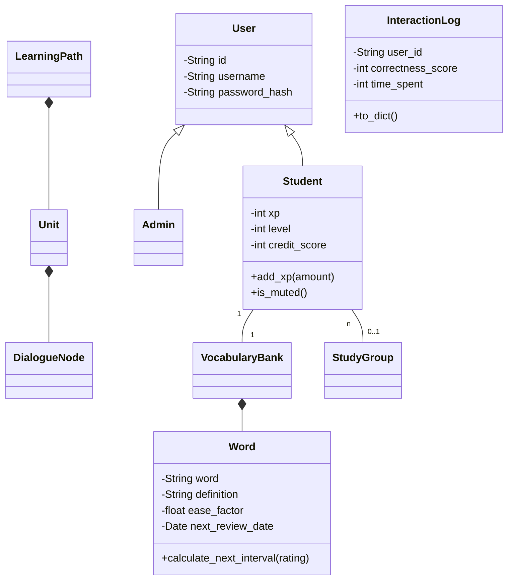

# Project Context: English Learning System (英文學習系統)

I am developing an OOAD-based English Learning System. You are my expert consultant. Please internalize the following system architecture and logic. We will build this iteratively; **you do not need to generate the whole system's files at once.**

---

## 1. Team & Responsibilities
*   **Account Management & Course Planning:** 高郁城
*   **Vocabulary Training, Course Interaction, & Analysis:** 呂沛修
*   **Gamification, Teams, & Content Reporting:** 蔡碩恩

## 2. Technical Architecture
*   **Frontend:** React (UI Components, State Management, API Client).
*   **Backend:** Flask API (API Routing, Business Logic, AI Tutor Module).
*   **Database:** MongoDB Atlas (NoSQL, Document-based storage).
*   **Data Access:** Repository Pattern (BaseRepository, UserRepository, etc.).

## 3. Class Diagram & Relationships

## 4. File Mapping (OOAD Structure)

The system's core modules are organized into the following file structure to support a clean object-oriented design:

*   **Account Management**: `app/models/user.py`, `app/services/auth_service.py`, `app/routes/account_api.py`.
*   **Course Arrangement**: `app/models/course.py`, `app/routes/course_api.py`.
*   **Database & Training (UC3)**: `app/repositories/`, `app/models/vocabulary.py`.
*   **Course Interaction**: `app/routes/interaction_api.py` (handles `DialogueNode` and `InteractionLog`).
*   **Result Analysis**: `app/services/srs_strategy.py` (implements the Strategy Pattern for adaptive forgetting curves).
*   **Gamification**: `app/services/game_observer.py` (implements the Observer Pattern for XP and Badge logic).
*   **Teams**: `app/models/team.py`, `app/routes/team_api.py`.
*   **Moderation**: `app/services/moderation.py` (manages the moderation "Safety Loop").

---

## 5. System Interaction Logic

The interaction between different use cases is governed by the following logic and design patterns:

*   **Strategy Pattern (UC3/UC5)**: This pattern allows the system to swap different algorithms for the Spaced Repetition System (SRS) to dynamically determine when a student should next review a specific word.
*   **Observer Pattern (UC6)**: The system automatically triggers `add_xp()` and `check_and_award_badge()` functions immediately upon the completion of learning tasks.
*   **The Progress Loop**: `InteractionLogs` serve as data input for the `AnalyticsEngine`, which subsequently updates the attributes of `Word` objects stored in the `VocabularyBank`.